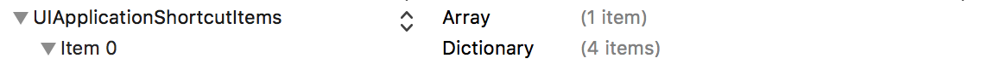
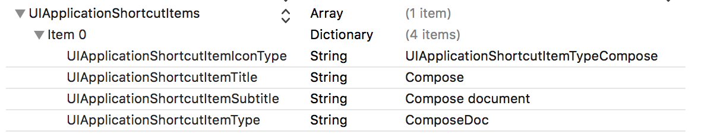
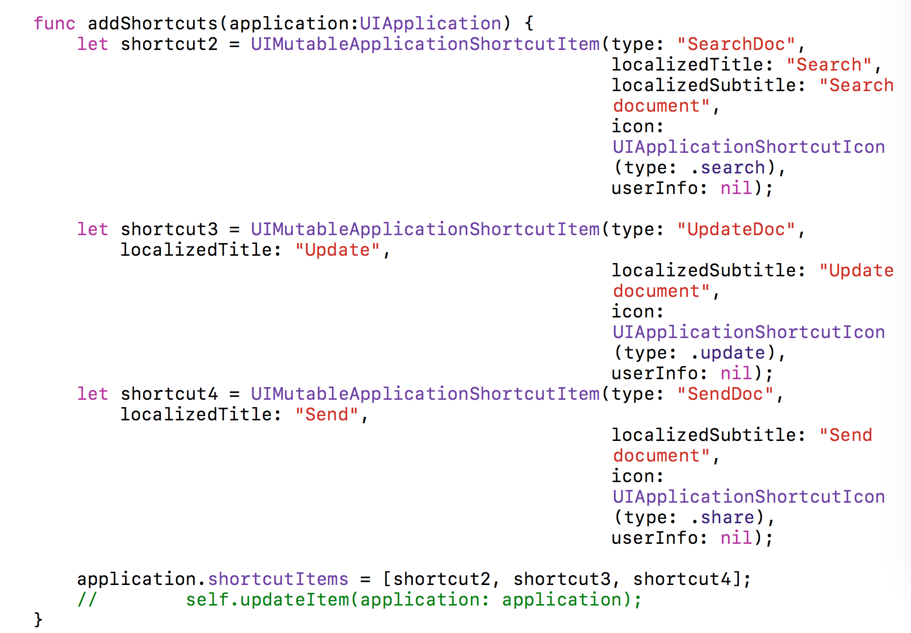
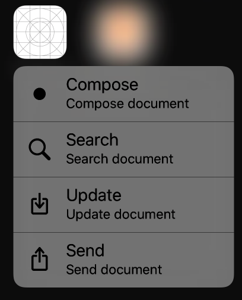
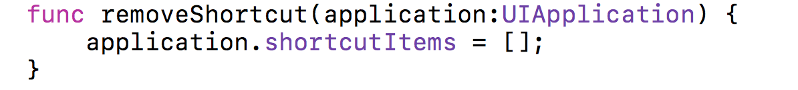
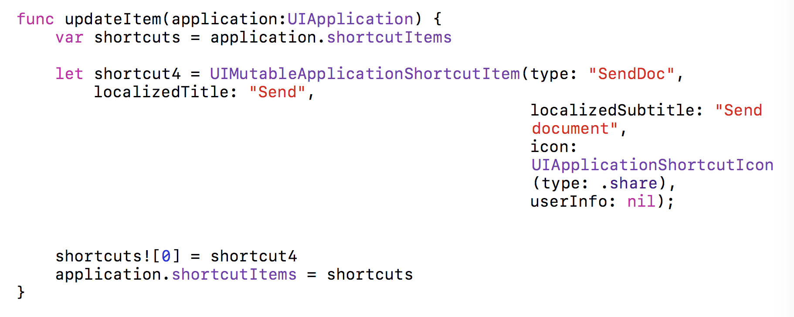
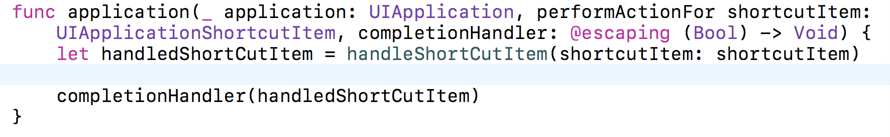
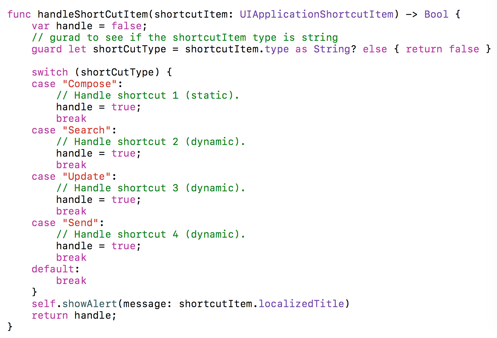

# How to Implement 3D touch to use Application shortcut Items in iOS devices
Apple developer documentation:[ https://developer.apple.com/library/content/documentation/UserExperience/Conceptual/Adopting3DTouchOniPhone/](https://developer.apple.com/library/content/documentation/UserExperience/Conceptual/Adopting3DTouchOniPhone/)

Inspired from:[ https://developer.apple.com/library/content/samplecode/ApplicationShortcuts/Introduction/Intro.html#//apple_ref/doc/uid/TP40016545-Intro-DontLinkElementID_2](https://developer.apple.com/library/content/samplecode/ApplicationShortcuts/Introduction/Intro.html#//apple_ref/doc/uid/TP40016545-Intro-DontLinkElementID_2)

Follow step by step guide to learn about how to create/use the shortcut items (quick actions) for your application in iOS device.

### Background:
Quick actions (application shortcuts) can be used by deep 3D press on the app icon at iOS device home screen. This will apply to devices which supports 3D touch (not all iOS device). 
There are two types of quick actions 

* Static quick actions - We can add them in info.list

* Dynamic quick actions - we can add it via runtime through code. 

#### `Static Quick Actions:`

	In this step we will learn how to add static actions in your application.

* First select info.plist file in your app. 

* At the last entry of the item in info.plist you can see  "+" add button click on it 

* It will create a new row and ask for key and enter "UIApplicationShortcutItems" 

* Now, it is the type of array as we can include more than one shortcut items so select array as type .

* Now click on the expand arrow on left side of item and click on "+" add button and select type as dictionary. Here we are creating dictionary because we can store multiple key-value pair as an object of array. 

* Click on the arrow to the left of the Item0 key so that it is pointing downward and click on the + button to add the first entry into the dictionary. 

* Now here use can add the information  you required to show for the item. 

* There are five keys right now available. 

    * [var localized Title: String](https://developer.apple.com/reference/uikit/uiapplicationshortcutitem/1623354-localizedtitle) :The required, user-visible title for the Home screen dynamic quick action.

    * [var localized Subtitle: String?](https://developer.apple.com/reference/uikit/uiapplicationshortcutitem/1623376-localizedsubtitle): The optional, user-visible subtitle for the Home screen dynamic quick action.

    * [var type: String](https://developer.apple.com/reference/uikit/uiapplicationshortcutitem/1623382-type):  A required, app-specific string that you employ to identify the type of quick action to perform.

    * [var icon: UIApplication Shortcut Icon?](https://developer.apple.com/reference/uikit/uiapplicationshortcutitem/1623352-icon) The optional icon for the Home screen dynamic quick action.

    * [var user Info: [String : NSSecure Coding]?](https://developer.apple.com/reference/uikit/uiapplicationshortcutitem/1623370-userinfo):Optional, app-specific information that you can provide for use when your app performs the Home screen quick action.

* You can see subtitle, shortcut Icon and user info are optionals. 

* At the end you will see something like this 

#### `Dynamic Quick Actions`

	In next step we will learn how to add dynamic actions in your application.

* To add dynamic quick actions we need to implement it. 

* We can add a method in the AppDelegate.swift to add those actions. 

* These items are using the mutable class "UIMutableApplicationShortcutItem" 

* Once you created the items you can use the shortcutItems array of application context. 

* To add dynamic quick action you can create a method and call it from AppDelegate.swift file and modify the didFinishLaunchingWithOptions method.

* You won’t see these item before launching the app one time because the code needs to execute before it shows output. So please allow application to run at least one time and then you can see all options like below image. 

* You can see total 4 items one we have added through static quick actions and other three from dynamic quick actions. 

#### `Edit Quick Actions`

* If you want to remove all items you can just simply do this. 

* If you want to update one of the item you can just replace the item in the array shortcutItems. 

#### `Responding to Quick Actions`

* When you select any item from menu it will call appDelegate method performActionFor shortcutItem:   and passed item "UIApplicationShortcutItem"

* As we are getting ShortCutItem object we can access the properties of the object. 

* You can see example below. 

#### `Test Quick Actions`

* As, I mentioned earlier to use the dynamic items you have to run app at least one time and you can see all the available options by pressing 3D touch on the app icon on Home screen. 

#### 'Summary'

* So, that’s all now you’re ready to implement this in your app. Just one last thing please read this Human interface guideline from Apple about quick action to avoid your app rejection from Apple.[ https://developer.apple.com/ios/human-interface-guidelines/extensions/home-screen-actions/](https://developer.apple.com/ios/human-interface-guidelines/extensions/home-screen-actions/)

If you have any questions, concerned please don’t hesitate to contact me.

Twitter: [@imrvshah](https://www.twitter.com/imrvshah)
